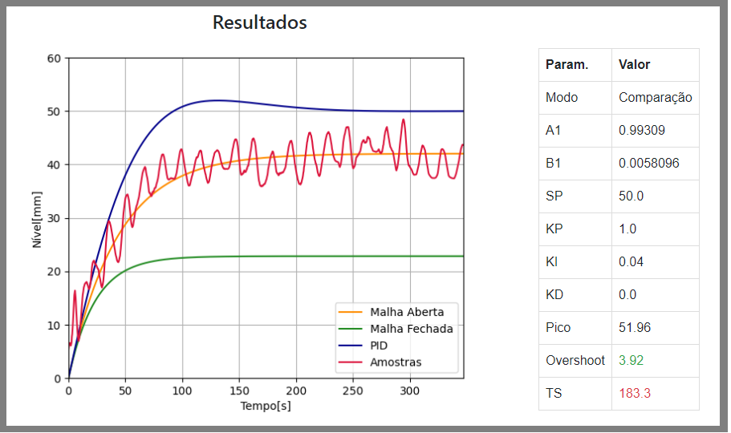

# ASM Control C213

Codigos para execução de Calculos, Interface e Controle de Hardware para a disciplina de  **C213 - Inatel**

### Este projeto Utiliza:
- Python (Testado v3.8)
- Flask
- MatplotLib
- Bootstrap/CSS/HTML/JS
- MongoDB
- Arduino

### Info:
Este projeto pode ser enviado diretamente ao Heroku.

Para executar localmente, utilize o script **Server.py**  
Para utilizar a versão web, acesse:  
https://c213-control.herokuapp.com/control/

(este link sera mantido online conforme a nescessidade)

### Exemplo de Graficos e tabela de resultados:

